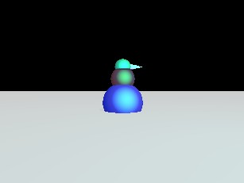
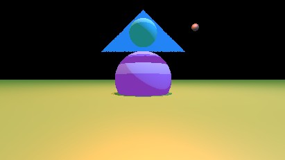
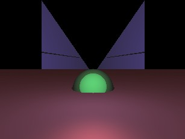
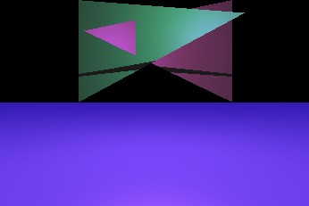
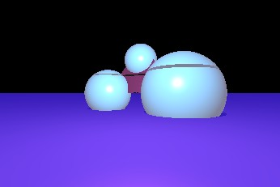
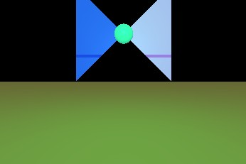
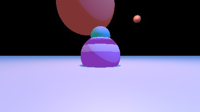

# raytracer

*This ray tracer is extremely in-progress and inefficient - not recommended for use!*

      

Load a 3D scene file and render a 2D image using ray tracing.

Built originally for COMP 371 Computer Graphics at Concordia University in Montréal, Québec.

Works on macOS and Linux. Should work for Windows, but not recently tested.

## Features

Pick a scene to ray cast, watch it be traced in real time, and save it to file!

## Specifying scenes

See [Scene description format](docs/scenes.md).

## Viewing saved output

Saved renders are placed in the [renders directory](renders/).

## Building

See [Building and running the project](docs/building.md).

## Acknowledgements

### Dependencies

Beyond the C++ standard library this application relies on:
* GLM
* STB (particularly the stb_image_write.h header library)
* tinyobjloader
* Boost
* SDL2 (for displaying the current state of the ray trace)

(Following standard setup procedure in a CMake-compatible IDE should fetch all these dependencies for you, so you shouldn't need to download them separately.)

### Other help

* Cross platform CMake setup created using [Hunter](https://github.com/ruslo/hunter)
* Thanks to this [StackOverflow answer](https://stackoverflow.com/a/35989490/4956731), and also this [other StackOverflow answer](https://stackoverflow.com/a/20091474/4956731), for helping me display my render with SDL
* Thanks to COMP 371 at Concordia for all the materials helping with various formulas for ray tracing
* Thanks to Scratchapixel tutorials for good explanations of geometric methods for find ray intersections with [spheres](https://www.scratchapixel.com/code.php?id=3&origin=/lessons/3d-basic-rendering/introduction-to-ray-tracing) and [planes/triangles](https://www.scratchapixel.com/lessons/3d-basic-rendering/ray-tracing-rendering-a-triangle/ray-triangle-intersection-geometric-solution).
