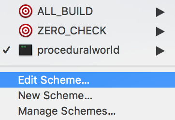
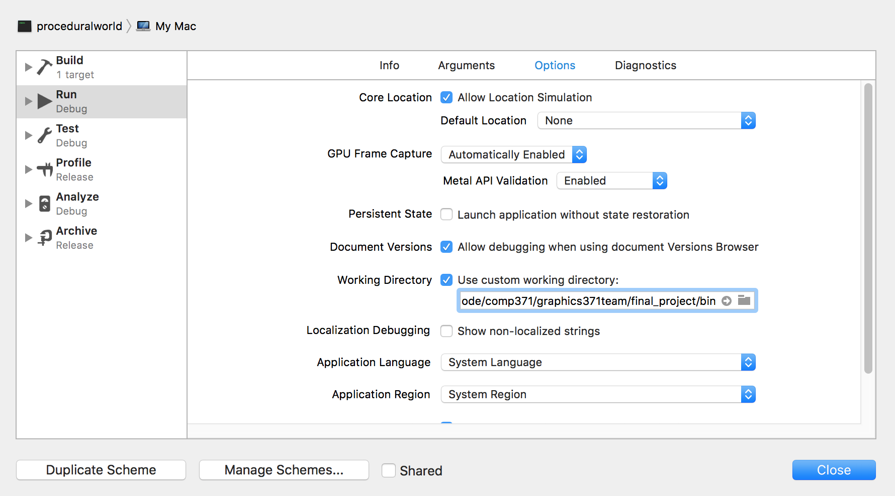

# Building and running the project

## Basic build requirements

* [CMake](https://cmake.org) version 3.8 or higher
  * On Windows: Make sure to check option for "add CMake to system path".
  * On Linux: If you need to build from source, [don't forget the `--system-curl` flag](https://github.com/ruslo/hunter/issues/328#issuecomment-198672048)!
* Appropriate C++ build tools for your system:
  * XCode tools on Mac
  * MinGW on Windows
  * You might already be set on Linux, but if not you'll need to figure this one out yourself. 😃

## Getting the project running

Optional first step: [define a `HUNTER_ROOT` environment variable](../hunter_installs/README.md) (useful if you're running multiple Hunter projects on the same machine).

The following steps will depend on your IDE/environment:
* [Command line](#command-line)
* [CLion](#clion)
* [Xcode](#xcode)
* [Visual Studio](#visual-studio)

### Command line

From the project directory:

1. Generate the project: `cmake -H. -B_builds`
2. Compile and link: `cmake --build _builds`
3. Enter the `bin/` directory: `cd bin/` (the working directory is important for program function)
4. Run the program: `./raytracer`

#### Debug mode

If you want debug console output you can pass some extra flags during the generate and build steps:
* Generate project: `cmake -H. -B_builds -DHUNTER_STATUS_DEBUG=ON -DCMAKE_BUILD_TYPE=Debug`
* Build: `cmake --build _builds --config Debug`

### CLion

CLion is a recommended IDE since it's built for handling CMake projects. However, it costs money. If you need a free 1-year student license you can get that [here](https://www.jetbrains.com/shop/eform/students).

#### Windows only: MinGW setup

1. Download and install MinGW ([click here to install](http://www.mingw.org/download/installer?)).
2. When installation is done hit continue.
3. Select `mingw32-base`, `mingw32-gcc-g++`, and `msys-base`.
4. `Installation -> Apply Changes -> Apply` to download and install the relevant packages.
5. When you see "All changes were applied successfully", hit close and exit the installation manager.

#### All platforms: building and running in CLion

1. On startup select "Open Project", and select the project directory.
2. Once the project is opened, it should automatically build.
4. *Possible Windows error:* if you see a message similar to, `For MinGW to work correctly C:\Program Files\OpenSSH\bin\sh.exe must NOT be in your PATH` go to `File -> Settings -> Appearance & Behavior -> Path Variables` and add `PATH` to the Ignored Variables, hit OK, and try again.
5. Press the green play button to build and run the program.

### Xcode

Before you open the project in Xcode, you'll need to generate project files using CMake.

#### CMake GUI

1. Browse and select the project directory both as "Where is the source code" and "Where to build the binaries".
2. Hit "Configure".
3. "Specify the generator for this project": select Xcode.
4. Accept the other defaults and hit "Done".
5. CMake will now download dependencies and set up some things, so you'll see some log output at the bottom of the screen for awhile.
6. When that's finished you should see "Configuring done" and a bunch of keys and values (e.g. `CMAKE_CONFIGURATION_TYPES`) highlighted in red.
7. Now hit "Generate", and after a few seconds you should see "Generating done".

#### Xcode

We're almost done, but we need to change a couple of settings first.

1. Your project directory should now have a file called `Raytracer.xcodeproj`. Open it in Xcode.
2. Once the project is open, change your running target from "ALL_BUILD" to "raytracer".

3. In the same menu, select "Edit Scheme...".

4. Under the "Options" tab select "Use custom working directory" and choose the `bin/` directory under the main project directory (you may need to create this directory if this is your first time building).

5. Hit the play button to build and run the program.

### Visual Studio

*coming soon!*

We still need to document steps for getting this program running in Visual Studio, but steps similar to those for Xcode may work on Windows. If you have success with this, please submit a pull request!
